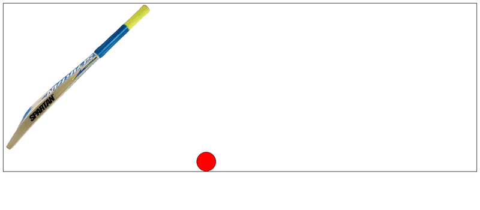
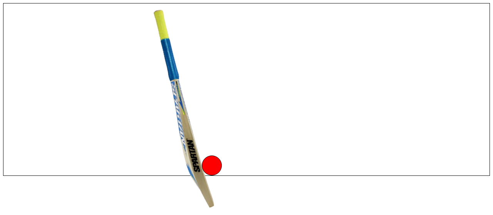
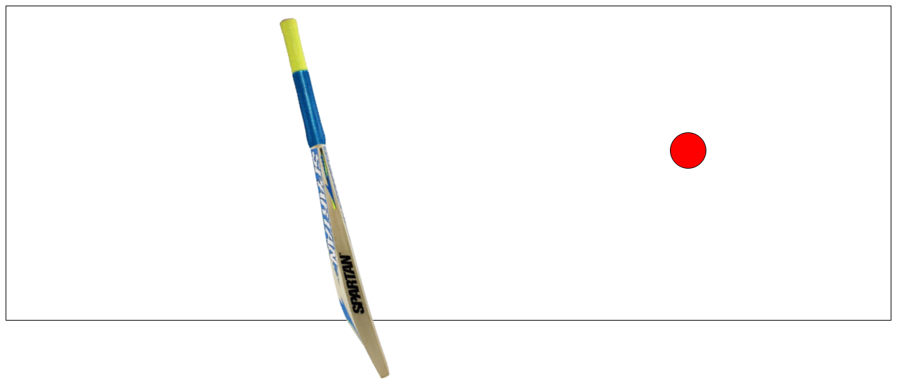

# Cricket Shot: CSS Hover Animation

Hover over the box and a cricket bat swings while the ball flies off, using only CSS transitions.

**Live page:** <https://shayan-abrar.github.io/Cricket-Animation/>

<p align="center">
  
</p>

<table>
  <tr>
    <td align="center" width="33%"><a href="screenshots/rest.png"></a><br><sub><b>At rest</b></sub></td>
    <td align="center" width="33%"><a href="screenshots/swing.png"></a><br><sub><b>Swing</b> · 0.11 s</sub></td>
    <td align="center" width="33%"><a href="screenshots/flight.png"></a><br><sub><b>Ball in flight</b> · 0.42 s</sub></td>
  </tr>
</table>

This is a small experiment in making two CSS transitions feel like cause and effect. One `:hover` starts both, but the ball waits a fraction of a second until the bat has swung. There's no JavaScript, so the whole effect is about 20 lines of CSS in `index.html`. The screenshots are real frames of the transition, paused at the times shown.

## Quick Start

```bash
git clone https://github.com/SHAYAN-ABRAR/Cricket-Animation.git
cd Cricket-Animation
python3 -m http.server 8000
```

Open <http://localhost:8000> and move the mouse over the box. On Windows, use `python` instead of `python3`. You can also open `index.html` directly, because the page has no external dependencies.

## Features

- **One trigger:** `:hover` on the `.field` container starts both animations.
- **Bat swing:** the bat rotates `-60deg` around its top-right corner in 0.1 seconds.
- **Delayed ball:** the ball moves `translate(1000px, -500px)` over 1 second with `ease-out`, starting after a 0.13-second delay so it leaves only after the bat connects.
- **Automatic reset:** moving the pointer away plays both transitions in reverse.

## How It Works

These are the rules from the `<style>` block in `index.html`:

```css
.field:hover .bat {
    transform: rotate(-60deg);
    transform-origin: top right;
}
.field:hover .ball {
    transform: translate(1000px, -500px);
}
.bat {
    transition: transform 0.1s;
}
.ball {
    /* size, color and position omitted */
    transition: transform 1s ease-out 0.13s;
}
```

To change the timing of the shot, adjust the `0.13s` delay on `.ball`. To send the ball somewhere else, change the `translate()` values.

## Limitations

- Positions are fixed in pixels (`left: 515px` for the ball and a `1000px` move), so the effect is tuned for wide screens. On a phone-sized screen the ball starts outside the visible area.
- On touch screens, `:hover` only triggers on tap.
- The `images/holiday.*` files aren't used by the page.

## Tech Stack

- HTML5
- CSS3 transitions and transforms

## Contributing

Suggestions and bug reports are welcome. Please [open an issue](https://github.com/SHAYAN-ABRAR/Cricket-Animation/issues). Please read the license note below before reusing any code or images.

## License

This repository doesn't have a license yet, so it doesn't grant anyone permission to reuse or redistribute its code or images. Please ask before reusing any part of it.

---

Built by **Shayan Abrar** · [GitHub](https://github.com/SHAYAN-ABRAR) · [LinkedIn](https://www.linkedin.com/in/shayan-abrar/)
