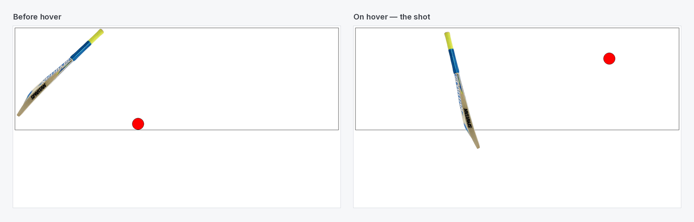

# Cricket Shot — Pure CSS Hover Animation

Hover over the field and the batter plays a shot: the bat swings and the ball flies off toward the boundary. It's built entirely with **CSS transforms and transitions**, with no JavaScript.

[](https://shayan-abrar.github.io/Cricket-Animation/) <!-- live-demo -->




## How It Works

```css
/* The bat swings around its top-right corner */
.field:hover .bat {
  transform: rotate(-60deg);
  transform-origin: top right;
}
.bat { transition: transform 0.1s; }

/* The ball is hit a moment later and eases out */
.field:hover .ball {
  transform: translate(1000px, -500px);
}
.ball {
  border-radius: 50%;
  transition: transform 1s ease-out 0.13s;
}
```

- `:hover` on the parent `.field` triggers both child animations at once.
- A fast **0.1s** bat swing plus a **0.13s** delay on the ball makes the ball move only after the bat connects.
- `ease-out` slows the ball down as it travels, which gives the shot a natural feel.

## Run Locally

```bash
git clone https://github.com/SHAYAN-ABRAR/Cricket-Animation.git
cd Cricket-Animation
# Open index.html and hover over the field
```

## Author

**Shayan Abrar** · [GitHub](https://github.com/SHAYAN-ABRAR) · [LinkedIn](https://www.linkedin.com/in/shayan-abrar/) · [Portfolio](https://shayan-abrar.vercel.app)
